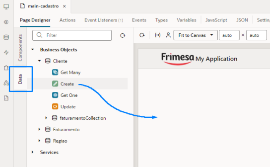
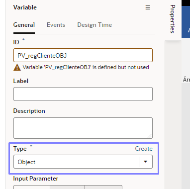
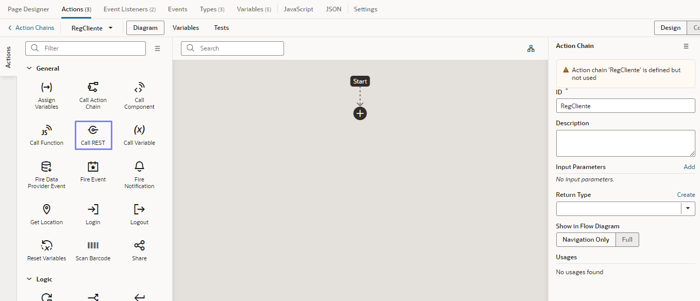
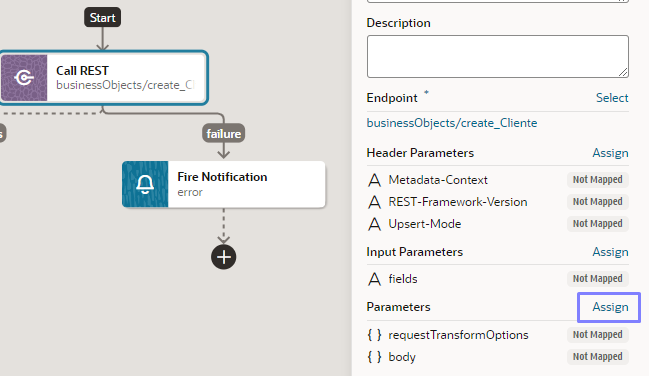
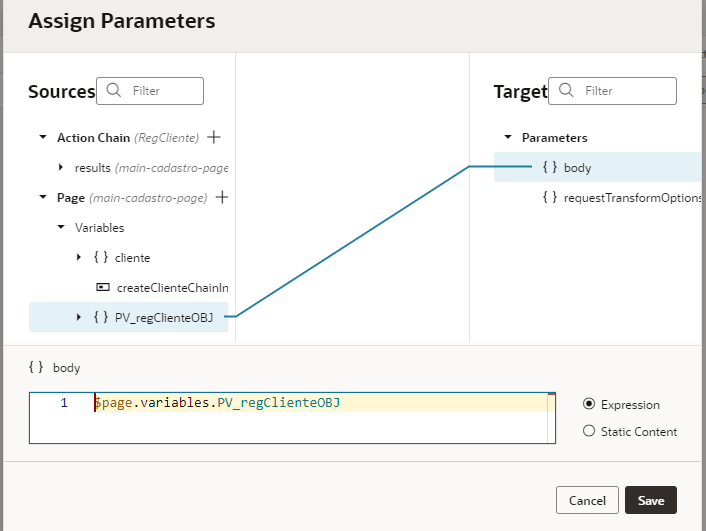
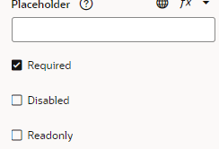
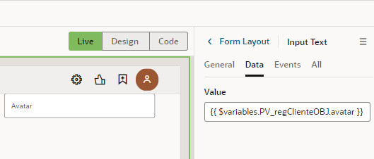
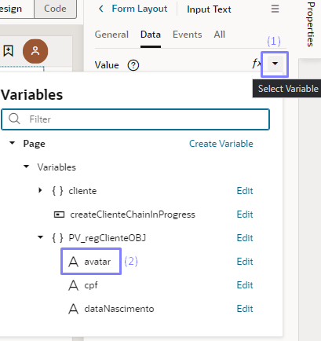

# MÓDULO III - Components

**MÓDULO III – Components**

**3.6 – Prática:** Criar um formulário para adicionar clientes. (Usando o Wizard do VBCS e Manualmente)

**A) Método Wizard**

- Nas ferramentas laterais da tela, vá na opção **Data**, expanda o Business Objects e você irá perceber que todas as suas BO’s estarão disponíveis para você realizar qualquer método dentro delas, como por exemplo o método **Create** que iremos fazer agora através de um formulário.
- Arrasando o item **Create** para dentro da nossa página (assim como instrui a seta da imagem acima), você irá posicioná-lo de preferência na extrema esquerda, para que fique um espaço reservado para o outro formulário.
- Após arrastar, quando soltar no espaço será exibido uma caixa flutuante com duas alternativas de criação “Create Form Dynamic” e “**Create Form**”, você deve selecionar a opção **Create Form.** Por agora não iremos utilizar componentes dinâmicos, apenas os padrões.
- Assim que a opção for selecionada, aparecerá o seguinte pop-up:

- Selecione todos os campos que forem atributos da BO assim como na imagem. Em seguida clique em **Finish**.
- E pronto! Seu formulário de registro está finalizado, funcionando através de **actions**, **types** e **variables** criados automaticamente. Se o resultado for igual à ilustração abaixo, já é possível cadastrar os dados:

**B) Método Manual**

- O primeiro passo, é criar um objeto que contenha os campos que enviaremos para a Business Object **Cliente**, e para isso, ainda na página de cadastro, iremos até a aba Variables e clicar no botão “**+ Variable**”:
- De preferência, crie um padrão de nome para fins de gestão de projeto, como acima: PV (Page Variable); reg(registro); OBJ(object). E atente-se à seleção, verifique se está selecionando a opção Variable, e se no **type Object.**
- Após isso, clique em **create** e você perceberá que no canto direito da tela vai estar sendo exibido as **propriedades** da variável selecionada.
- Como queremos que nosso objeto seja composto pelos atributos da tabela Cliente, vamos agora pra aba “**Types**” criar os tipos e os campos correspondentes.
- Clique na opção **From Endpoint**, e em seguida procure pelo método POST no caminho **Business Object > Cliente**. Selecione o item e clique em **Next:**
- Depois, será apresentado um pop-up semelhante ao do Wizard, e você fará a mesma coisa, marque os campos que você vai usar e aprte Finish:
- Agora retornamos à página **Variables** e selecionamos a variável *PV_regClienteOBJ* que criamos no início, para que assim as informações de suas propriedades apareçam no canto direito da página.

- Assim que visualizar, vá até a propriedade **Type** e selecione o Types Object que acabamos de criar:
- Posteriormente podemos perceber que o nosso objeto foi populado pelos campos do types object que criamos.
- Iremos agora criar uma ação que envia o objeto para a BO via REST: para isso, navegue para a aba **Actions** e aperte o botão “**+ Action Chain**”:
- OBS: Para que sua corrente de ações (action chain) seja igual aos exemplos que serão passados aqui, verifique se a opção **JSON** está selecionada (como marca a imagem acima), para que você desenvolva em formato de diagrama.
- Assim que criar a action chain, você será direcionado para dentro dela:

- Ao lado esquerdo temos várias **actions** organizadas por categoria, e será através delas que montaremos nossa corrente lógica para implementar funcionalidade ao nosso formulário.
- Nossa primeira action será a **Call REST** (demarcada na ilustração acima por uma caixinha azul). Você pode criar uma action de duas maneiras: arrastando-a para dentro da corrente; clicando no ícone **+** (indicada inicialmente pela seta de **Start**), expandindo a categoria que corresponde a action que deseja e selecionando-a.
- Depois de atribuir a action Call REST à corrente, clique nela, pois em seguida ao lado direito da página será exibido as propriedades dela. Na propriedade **Endpoint** Clique em **Select** baseando-se na imagem:
- Abrirá um pop-up disponibilizando métodos em Service e Business Object. Assim como já fizemos com a criação do nosso objeto e tipos de objetos, vamos utilizar o método POST para nossa BO Cliente:
- Prosseguindo, após apertar o botão Select, ação Call REST terá novas propriedades, como por exemplo a propriedade “**Parameters**” que iremos usar. Para enviar dados via Call REST, precisamos popular o parâmetro **body** desta ação, atribuindo como argumento o objeto que criamos. Portanto, na propriedade Parameters, clique em **Assign**:

- Abrirá o seguinte pop-up:

- Ligue o objeto ao body, como é mostrado na imagem e em seguida clique em **save**.
- Depois do feito, voltamos à nossa corrente de ações.
- Perceba que quando criamos nossa ação Call REST, veio outra ação junto a ela, a **Fire Notification** do tipo error. Perceba também que a Call REST gerou dois caminhos, success e failure, visto que a Fire Notification está no caminho de falha. Pois bem, o diagrama já é autoexplicativo, mas nossa action chain ainda não está completa devido não haver nada que notifique o êxito do nosso processo, logo, basta inserirmos uma ação de notificação no caminho de sucesso dessa nossa corrente, ficando assim:
- Agora, vamos criar a interface para consumir todo esse processo que criamos manualmente. Navegue para a aba **Page Designer** e verifique se a ferramenta lateral **Structure** está aberta.
- Troque o layout do componente que engloba o formulário para flex. E em seguida deixe seu justify como space-between:
- Clique com o botão direito do mouse em cima do mesmo componente e, insira um novo componente dentro dele, chamado **Form Layout**:
- Defina o Label Edge do form como **Inside**:
- Agora vamos começar o processo de criação de inputs para dentro do form, com seus devidos tipos. Clique com o botão direito sobre o Form Layout e insira dentro dele o input necessário:
- Atribua o dado do input ao item de referência que está no nosso objeto:

- Basta agora repetir o mesmo processo para o resto dos inputs que faltam. Se atente aos tipos de inputs que for criar, por exemplo, se eu quero que meu formulário tenha um campo de data, vou incluir um Input Date nele.
- Ao final do formulário, adicione um botão para enviar os dados:
- Clique em **Events** onde marca a caixinha azul e, após isso, clique no botão **+ New Event** e em seguida **+ New Custom Event:**
- Agora siga os passos a seguir:
- Após clicar em Select Action Chain, você estará atribuindo a corrente de ação que criamos anteriormente para o botão, fazendo com que agora seja possível enviar os dados para a tabela Cliente. Se você preencher todos os campos corretamente, clicar no botão de registrar cliente e acionar a notificação de sucesso, então, o formulário está funcionando.

**3.7 – Prática** – Criar um grid exibindo os clientes cadastrados. (Usando o Wizard do VBCS e Manualmente)

**A) Método Wizard**

- Assim como a criação do formulário via Método Wizard, repita o mesmo processo com a criação da tabela de exibição, com a diferença de que você deverá arrastar o item **Get Many**:
- Depois clique na opção **Table** (sem o dynamic); selecione todos os campos que queira exibir; dê um clique em Next; clique em Finish.

**B) Método Manual**

- Antes de iniciar, para organizar nossa página, vamos trocar o layout do componente que engloba a tabela para flex.
- E depois, deixaremos sua direção como vertical, ficando assim:
- E para organizar mais um pouco, colocaremos um título que separe a tabela que acabamos de finalizar, com a nova que ainda iremos começar.
- Após o título “Método Manual”, insira um componente **Table**.
- Agora só precisamos adicionar os dados que queremos exibir nesta tabela, e para isso, vá até a aba Quick Start do próprio componente Table e clique em **Add Data**:
- Em sequência, clique na BO que você quer consumir os dados e depois em Next:
- E depois, selecione todos os campos que serão exibidos por esta tabela; clique em **Next** e depois em **Finish**.

**3.8 – Prática** – Criar uma lista com os clientes cadastrados. (Usando o Wizard do VBCS e Manualmente)

**A) Método Wizard**

- Crie uma página separada para desenvolver as duas listas de exibição (wizard e manual).
- Depois realize o mesmo processo de criação que o wizard anterior, no entanto, como vamos utilizar listas, selecione a opção **List** após soltar o item Get Many.
- Será apresentado dois templates para você criar essa lista, escolha o mesmo que será utilizado nesta aula:
- Clicando em Next para irmos à próxima tela. Selecione os campos que serão exibidos com seus devidos tipos:
- E mais uma vez clique em Next, e depois em Finish.
- Para uma melhor visualização, defina o tamanho da imagem do avatar em 80x80, e, insira uma barra vertical “|” na concatenação do **Secondary slot** e **Tertiary slot**:
- Ative o **Padding Off** do componente **List Item Layout**:
- Resultado:

**B) Método Manual**

- Para que possamos visualizar a lista que acabamos de criar com a que será criada agora, temos que preparar o layout da página para isso. Mude o layout do componente pai que engloba a lista, para **flex.** E no mesmo componente, defina a propriedade **Wrap Items** como **Don’t Wrap**.
- Insira um componente chamado **List View** para dentro deste componente pai, ficando agora, duas listas dentro de um Flex Component.
- Por último, defina a largura **para as DUAS listas** em 50%: selecione a lista, vá para a aba **All**, e, em **General Attributes**, coloque “*width: 50%;*” na propriedade **Style**:
- O resultado será este:
- Esta será a lista que consumirá os dados que serão chamados.
- Como queremos que o layout fique semelhante à lista da esquerda, primeiro remova a **div** responsável pela **Metadata**, mantendo somente o ícone ilustrativo e os três slots.
- Agora, crie um **ADP** (Array Data Provider): vá na aba **Variables** e adicione uma variável do tipo ADP nomeada de *PV_getallClienteADP*.
- Em seguida, vá para a aba **Types**, clique na opção **From Endpoint** e procure pelo método GET no caminho **Business Object > Cliente**. Selecione o item e clique em **Next**. Agora selecione o array **items** como sendo nossa estrutura do endpoint, e além disso, renomeie a tipagem para *PT_getallCliente.*
- Como precisamos que nossa estrutura seja apenas um simples objeto, vá para a aba **JSON** e faça a seguinte alteração:
- Volte para a aba Variables, e com a variável *PV_getallClienteADP criada, defina seu **Item Type** para a tipagem que acabou de criar:*
- Feito isso, crie uma Action Chain em JSON seguindo a imagem abaixo:
- Adicione a ação **Call REST** e defina o seguinte Endpoint **GET /Cliente** para a mesma:
- Em sequência, adicione a ação **Assign Variables** no caminho “**success”** do Call REST.
- Na mesma ação, clique em na propriedade Assign, para atribuitmos a resposta do Call REST ao nosso ADP:
- Realizada a ligação, clique em Save. Corrente de ações finalizada.
- Volte para a aba Page Designer realize os seguintes passos para atribuir a corrente como um evento padrão da página:
- Selecione o componente **List View** e, na propriedade **Data**, insira o ADP que foi criado:
- Neste momento o List View está consumindo os dados dessa variável ADP, e agora, basta chamar os campos que deseja exibir. Para realizar o processo e ao mesmo tempo ser fiel ao layout da lista (já finalizada) da esquerda, faça os seguintes procedimentos:
- Perceba que cada div está simbolizada com seu devido slot, ou seja, se uma div é do **slot leading**, será representada por **div@leading**. Ela só não terá essa representação caso seja de slot default (padrão).
- Depois de realizar o procedimento anterior (duplicar a div), temos agora duas div’s de slot default, visto que, a div de cima será o nome da pessoa e a de baixo a idade (assim como o layout da lista esquerda). Para exibir/chamar esses dados, devemos selecionar sua variável na propriedade **Text** da própria div, então para isso, siga o exemplo abaixo onde é realizado a atribuição do nome à lista:
- Faça o mesmo processo para o resto dos dados que virão abaixo do nome. O resultado deve ser este:
- Claramente está faltando o avatar da pessoa, pois então, vamos implementá-la. Dentro do componente **div@leading**, se houver o componente-filho de nome **span** ou de qualquer outro nome, substitua-o para o componente **Avatar**.
- Tendo agora o componente em mãos, atribua a variável avatar como um dado para a fonte (**source/src**) deste componente. Siga a instrução abaixo:
- Finalizado! Se tudo ocorreu bem, o resultado esperado deverá ser assim:

**3.9 – Prática** – Criar uma lista com os clientes cadastrados. (Usando o Wizard do VBCS e Manualmente)